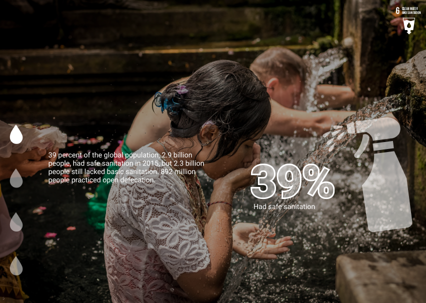

# Assignment2
### Description of the project
The project is a scrollytelling about the sustainable goal 6 Clean Water and Sanitation. 

### Why the project is useful
The project is useful, because it will reach out and inform people about the goal. In additon, the project also describes what we can do to improve the situation. 

### Get started with the project
Users can get started with the project by either using the fork option or by cloning this repository. When the user forks the project it is possible to make personal changes without affecting the origional project. Then the users can have their own brainstorming, implement new things and share their work with others. 

### Get help with the project
Users can consult learning materials (lectures) or open an issue on this github page to get help with this project.

### Technology
The language used in this project is html, scss, and js. To edit the project we are using Visual Studio Code. We have also used Scrollama to get animation while scrolling.

### Contributes
Thomas and Ingrid maintains and contributes to the project. 

## Design for Animation 
### Design idea
Different background pictures that changes from every scene with information about the goal. In addition, a water drop timeline on the side that indicates how long the story is. 

### Storyboard

### Animations
#### Animation on scene 1: 
When the user starts to scroll vertically a water drop from the glass will loosen and move from the glas and go down to the bottom of the scene as the same speed as the user scroll. When the water drop starts to move, it will change color and disappear when it hits the ocean. The ocean has waves that moves. When the user scroll the ocean will fill the whole screen. 

#### Animation on every scene (excluding scene 1):
When the user scroll down to the next scene, the background picture will change with a fade effect. The text will come from the buttom and goes to the top in the same speed as the user scroll. The current water drop from the waterdrop timeline is white (the other water drops is in some opacity of white) and it will fade away when the user has scrolled past the scene. Then a new water drop will appear more white than the other water drops. It is also possible to navigate to the top if the user clicks on the logo in the right corner. 

#### Animations on scene 2:
The number will count from 0 to 40% when the user scrolls. When it hits 40%, the text  on the other side will appear. 

#### Animations on scene 3: 
The one of four person svg will appear while scrolling with help of transition and scrollama. 

#### Animations on scene 4: 
The number counts up to 39% in the same way as on scene 2. On the side of the number it is an animated spraybottle.

#### Animation on scene 5: 
Many water drops are moving from the top to the bottom. The water drops are moving behind the text. 

#### Animation on scene 6: 
The lid to the garbage can moves up and down, and the garbage is placed inside when the user scrolls. 

#### Animation on scene 7: 
The bathtub has moving water and bubbles. 

#### Media queries:
We will use media queries to stop the animations if the user has turned off the animations on the settings of their desktop. We will also use media queries to affect how the user sees the background picture depending on the device being landscape vs portrait. We will use the media queries on the first slide to change the background color and the svg of the logo based on darkmode vs lightmode. 

### Link to our storyboard on figma
https://www.figma.com/file/kdyTKKDRkItuQt2JSbYhkJ/storyboard-goal-6?node-id=175%3A34
